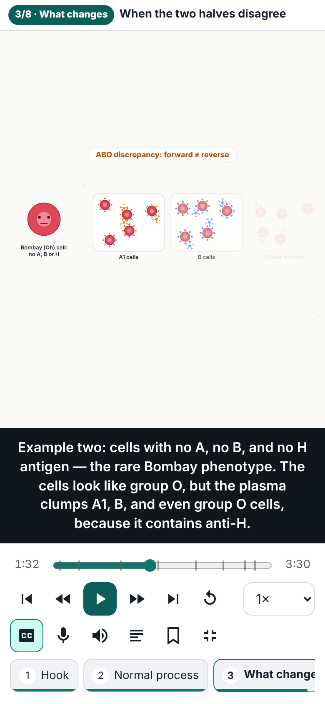
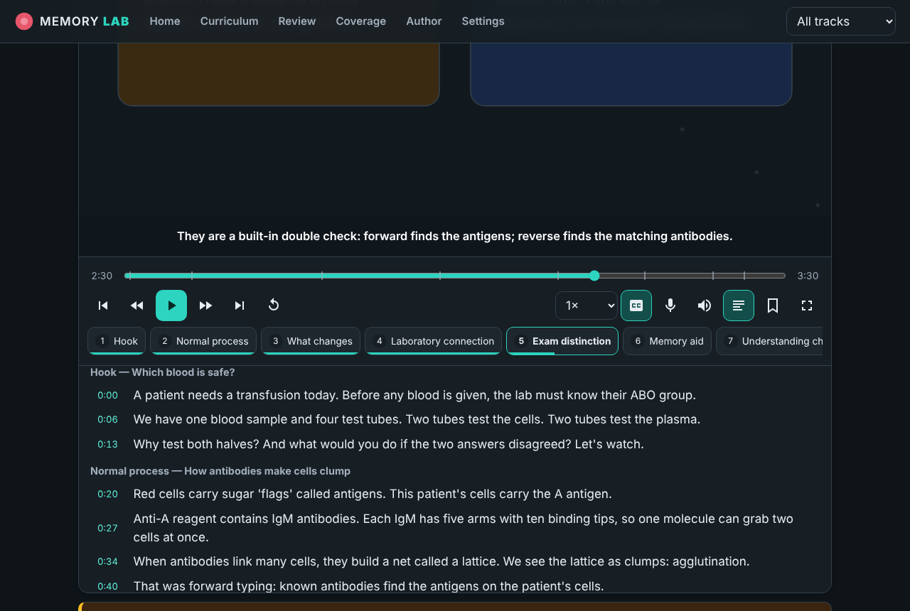

# MEMORY LAB

An animated Medical Laboratory Science reviewer. Each concept is taught as a short cartoon-style lesson: a hook, the normal mechanism, what changes, the bench connection, exam look-alikes, a memory aid with its limits, three explained questions, and a one-sentence takeaway. It has two study tracks: **MLS(ASCP)/ASCPi** and the **Philippine MTLE**.

> **Status (2026-10-07):** The application is complete and working. Your reviewer (*MEMORY LAB: The Memory-First Medical Laboratory Science Reviewer*, EPUB) is **fully inventoried**: 79 chapters → 1,932 concepts, mapped by chapter/section/item, since the EPUB has no page numbers. **20 lessons are complete** (Ch. 1–3 fully taught; 1 in Ch. 33 Hematology; 1 in Ch. 40 Blood Bank), teaching **78 of 1,932 concepts (about 4.0%)**. All 20 **require review**. The reviewer's 828-question Exam Simulator is imported as an unverified practice bank. A reviewer accuracy register lists 29 flags. See [`docs/COVERAGE.md`](docs/COVERAGE.md), [`docs/ACCURACY.md`](docs/ACCURACY.md) and [`docs/CONTINUATION.md`](docs/CONTINUATION.md).

## Screenshots

| Animated frames (one per caption) | Mobile full screen | Dark theme + transcript |
|---|---|---|
|  |  |  |

## Quick start

Requirements: Node.js 20+ (tested on 22).

```bash
npm install
npm run dev          # http://localhost:5173
```

Production build (a static site that works from any host or sub-path, with no server configuration):

```bash
npm run build        # outputs dist/
npm run preview      # serve dist/ locally
```

No accounts, API keys or paid services are needed.

## Scripts

| Command | What it does |
|---|---|
| `npm run dev` | Development server with hot reload |
| `npm run build` | Type-check and build to `dist/` |
| `npm test` | Unit tests (engine timing, schema validation, quiz scoring, weak areas, recommendations, coverage, persistence, content integrity) |
| `npm run validate` | Validate every lesson and the curriculum; lists anything incomplete or needing review |
| `npm run coverage:report` | Regenerate `docs/COVERAGE.md` from the content |
| `npm run e2e` | Browser verification in headless Chromium (run `npm run build` first). Set `CHROMIUM_PATH` if Chromium is not in `/opt/pw-browsers`. |
| `npm run check` | validate + test + build |
| `python3 scripts/reviewer/import_simulator.py source/epub/OEBPS content/question-bank/reviewer-simulator.json` | Re-import the reviewer's Exam Simulator from the unzipped EPUB |

## Features

- **Animated lesson player** (SVG, driven by data): play, pause, replay, seek bar with scene markers, previous/next caption, previous/next scene, speeds from 0.5× to 2×, synchronized captions (3 sizes), full transcript with click-to-seek and live highlighting, scene navigation, scene bookmarks, full screen (with a CSS fallback for iOS), and keyboard shortcuts.
- **Narration (optional, free):** uses the browser's built-in speech synthesis (Web Speech API). When narration is on, the clock waits at the end of each caption until the sentence finishes, so speech and visuals stay in sync. Mute is a separate toggle. If a browser has no speech engine, the narration button is disabled and captions carry the lesson. *Optional future setup:* to use recorded or cloud voices, add an `audio` URL per cue in the lesson JSON and play it in `src/player/narration.ts`. This is not implemented because no service is configured.
- **Reduced motion:** follows the operating system setting or a manual setting. Visuals change in discrete steps synchronized to captions, showing each step's settled end state with no tweening or pulsing.
- **Dashboard:** track selection, recommended next lessons, progress stats, weak areas, bookmarks, and a per-track blueprint showing weights and coverage.
- **Curriculum browser:** domain → topic → concept in learning order, prerequisites, status per concept, track filter, and full-text search that includes lesson captions.
- **Quiz:** immediate feedback, with a rationale on every option (why the answer is right *and* why each distractor is wrong), plus scoring.
- **Practice questions:** the reviewer's own 828-question Exam Simulator, imported at the rights holder's request as a separate, clearly labelled question source. Filter by area, chapter, new or missed; practice mode (feedback after each question, with the reviewer's explanation) or timed exam mode (90 s per question pace, review at the end). Questions are marked as not verified by this app, and questions touching open accuracy-register flags carry a visible note. Answers feed weak-area review and lesson recommendations. The bank loads on demand.
- **Weak-area review:** built only from real answers, recency-weighted, grouped by skill, topic and domain, with "retry missed questions".
- **Saved progress:** position, scenes seen, watched state, answers and bookmarks are kept in `localStorage`, with export, import and reset in Settings.
- **Authoring & preview:** edit lesson JSON in the app with live validation, a completeness checklist, a timeline table and a full player preview. Download the JSON when done.
- **Coverage & review dashboard:** complete lessons, lessons requiring review, drafts, pending concepts, reviewer mapping, and exam-outline verification status.
- Light and dark themes, phone-first layout, and accessible contrast (axe-checked).

## Architecture

```
content/                   ← all teaching content (JSON, no code)
  lessons/*.json           ← one file per lesson; picked up automatically
  curriculum.json          ← GENERATED from the reviewer: Parts → chapters → concepts (+ prerequisites, locators)
  tracks.json              ← exam tracks, areas, weights, verification notes
  reviewer.json            ← GENERATED: reviewer details + 79-chapter inventory with counts
  reviewer-review.json     ← accuracy register for the reviewer (flags + evidence)
src/
  schema/                  ← lesson schema types, validator, completeness rules, template
  engine/                  ← timeline/keyframe interpolation + reusable cartoon visuals
  player/                  ← LessonPlayer (clock, captions, narration, controls)
  logic/                   ← quiz scoring, weak areas, recommendations, coverage
  state/                   ← progress model + persistent store
  pages/, components/      ← UI
scripts/                   ← validate-content, coverage-report
scripts/reviewer/          ← EPUB extractor + curriculum builder (reads git-ignored source/)
source/                    ← git-ignored: the reviewer EPUB and its full-text extraction
tests/                     ← unit tests (vitest)
e2e/verify.mjs             ← browser verification (playwright-core + axe)
docs/                      ← coverage checklist, accuracy log, content guide, continuation plan
```

A lesson is pure data: scenes with absolute times, caption cues, and visual objects whose properties are animated by keyframes. The renderer (`src/engine`) interprets the data, so adding lessons does not require new code unless a lesson needs a new kind of visual. See [`docs/CONTENT_GUIDE.md`](docs/CONTENT_GUIDE.md).

A lesson counts as **complete** only if it passes the completeness check: all 8 beats in order; captions, visuals and real keyframed animation in every scene; the five-question explanation; a comparison; a mnemonic with its limitation; 3+ questions with a rationale on every option; a one-sentence takeaway; at least one consulted reference; a claims ledger; and no TODO placeholders. Complete lessons are still marked **requires review** until a named human expert reviews them, every claim is checked, and the lesson is mapped to the reviewer.

## Honesty rules built into the code

- A "checked" claim must cite a reference marked `consulted: true`; otherwise validation fails.
- `humanExpertReview: true` fails validation unless a reviewer is named. No lesson claims expert review.
- The content tests fail if any lesson claims reviewer mapping while `reviewer.json` says the reviewer was not received.
- The footer states that the app is not affiliated with or endorsed by ASCP, the ASCP BOC, or the PRC.

## Deploying

`dist/` is a static site. Hash-based routing means any static host works (GitHub Pages, Netlify, Vercel, S3), with no rewrite rules needed.
